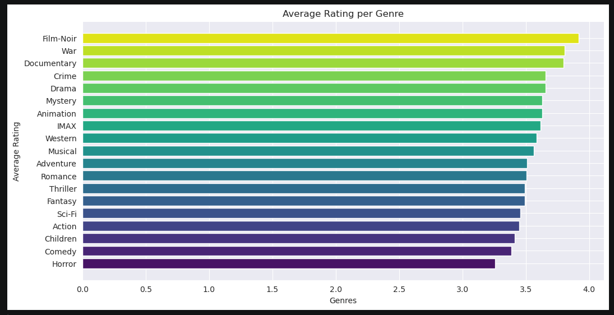
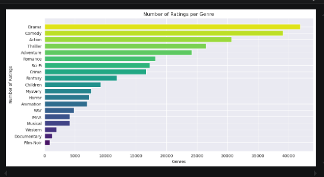
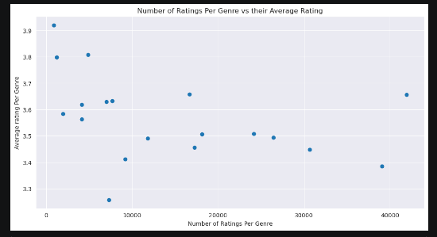
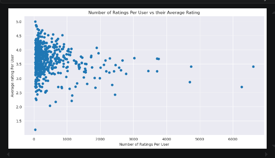

# MovieLens Recommendation System

## Repository Overview

This repository contains all materials for the MovieLens Recommendation System project. The project analyzes historical movie ratings to build a collaborative filtering recommendation system that predicts user preferences and delivers personalized movie suggestions to improve content discovery and engagement.

---

## Project Overview

This project builds a personalized movie recommendation system using the MovieLens dataset to help users discover relevant content based on their past ratings. With the overwhelming number of movies available on modern streaming platforms, the system addresses the challenge of content overload by predicting user preferences and suggesting top-rated unseen movies.

The solution leverages collaborative filtering techniques, specifically K-Nearest Neighbors (KNN) and Singular Value Decomposition (SVD), to identify patterns in user behavior and generate accurate recommendations. Model performance is evaluated using RMSE to select the most effective approach.

Beyond improving user experience, this project highlights how recommendation systems can drive engagement, retention, and personalization—particularly in emerging digital markets where tailored content delivery is becoming increasingly important.

---

## Repository Contents

### Data
The `data/` directory contains the aviation accident dataset used for analysis.

- `movies.csv` – This dataset holds the movie title and the genres associated to the respective movies all numbered up with their movieID.
- `ratings.csv` - This dataset holds the userID, movieID and their corresponding ratings as well as the movies' timestamp.
- `combined_df.csv` - This is a dataset that is a result of merging `movies.csv` and `ratings.csv`
- `combined_df_exploded` - This is the same dataset as `combined_df` but the genre column has been exploded for better analysis.

---
### Images
This file holds the visualisations that were conducted in the Exploratory Data Analysis (EDA) section of the notebook. The visualisations / images are :
   - **Avg Rating Per Genre**:

   

   *Insight: Genre ratings do not vary significantly. There are no content preferences*

   - **Num of Ratings Per Genre**

   

   *Insight: Some genres are highly rated but not widely watched* 

   - **Num of Ratings Per Genre vs Their Avg Rating**

   

   *Insight: There is no strong correlation between genre popularity and average rating*

   - **Num of Ratings Per User vs Avg Rating**

   

   *Insight: Most users are inactive. A small group of power users contribute to the majority of ratings*

---

### Notebooks

- [Notebook](./notebook.ipynb) 

---

### Dashboards
Interactive visualizations were created using Tableau and published online.

- [Dashboard](https://public.tableau.com/app/profile/carl.collins/viz/MovieLensRecommendationVisualisations/Story1)
  

---

### Presentation
A non-technical presentation summarizing the analysis and business recommendations.

- [Presentation](./presentation.pdf)

---

## How to Use This Repository
1. Review the notebook to understand the analysis and methodology.
2. Explore the interactive Tableau dashboards using the link above for hands-on visualization.
3. View the presentation PDF for a high-level summary of insights and recommendations.
